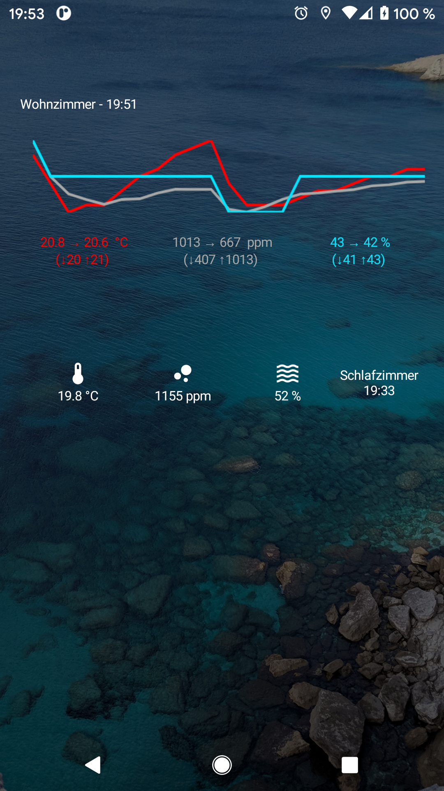
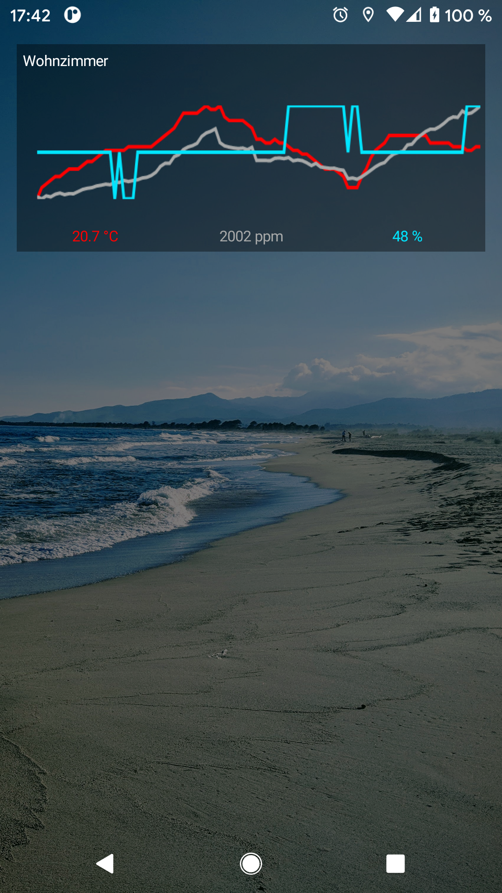

# simplenetatmo
A simple weather widget for the Netatmo weather station

SimpleWeather Widget for Netatmo Weather
=========

A simple yet customizable weather widget showing information from your Netatmo weather stations

<table sytle="border: 0px;">
<tr>
<td></td>
<td></td>
</tr>
</table>

